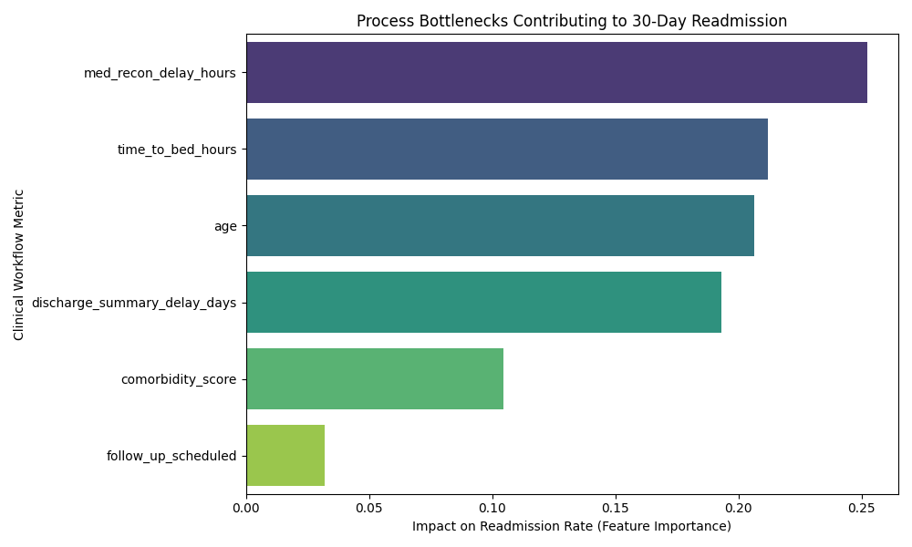

# Readmission Workflow Optimization 🏥📊

## Project Overview
This project models patient data flows to identify clinical process bottlenecks that contribute to 30-day hospital readmissions. By analyzing workflow metrics, this repository provides data-driven recommendations to improve care coordination and reduce readmission penalties.

*Note: To comply with HIPAA and protect patient privacy, this analysis is built on a generated synthetic dataset that mimics real-world hospital operational flows.*

## The Problem
High 30-day readmission rates negatively impact patient outcomes and result in heavy financial penalties for healthcare networks. The goal of this analysis is to move beyond standard patient demographics and analyze the **operational workflow** to find points of friction in care delivery.

## Methodology
1. **Data Simulation:** Generated a synthetic dataset tracking 5,000 patient journeys, including metrics like medication reconciliation times, discharge summary delays, and bed placement times.
2. **Process Modeling:** Utilized Python (`pandas`, `scikit-learn`) to build a Random Forest classification model to predict readmissions.
3. **Bottleneck Identification:** Extracted feature importances to isolate which operational delays had the highest correlation with returning to the hospital within 30 days.

## Key Findings (The Bottlenecks)
Based on the predictive model, the primary workflow bottlenecks driving readmissions were:

1. **Medication Reconciliation Delays:** Slower pharmacy sign-offs at discharge were the #1 predictor of a patient returning within 30 days, likely leading to medication non-adherence post-discharge.
2. **Time to Bed:** Delays in getting admitted patients into an inpatient bed heavily correlated with negative outcomes. 
3. **Delayed Discharge Summaries:** A delay in sending discharge summaries to Primary Care Providers (PCPs) caused critical gaps in continuous care.

## Recommended Workflow Changes
Based on the data, I recommend the following changes to improve care coordination:
* **Pharmacy Parallel Processing:** Shift medication reconciliation earlier in the discharge timeline (e.g., 12 hours prior to expected discharge) rather than waiting for the final physician sign-off.
* **Automate PCP Notifications:** Integrate an automated alert system that sends draft discharge summaries to a patient's primary care doctor within 24 hours of discharge.
* **Bed Management Analytics:** Implement a real-time bed tracking dashboard for nursing supervisors to reduce ED boarding times.